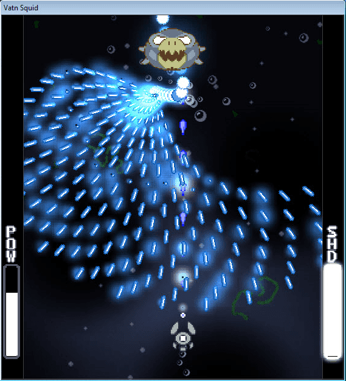

# UE4 2D SIDE SCROLLING BULLET HELL
* W projekcie używam gotowego szablonu projektu 2D side scrolling
* Pliki modyfikuję dla swoich potrzeb
* Assetty szukane w internecie
* Technologia:Unreal Engine 4 2D
* Mechanika:Side Scrolling
* Gameplay:Bullet Hell
* Komentarze do kodu w języku angielskim żeby łatwiej pracowało się z tutorialami
* Planowane funkcje:
	- Strzelanie różnymi pociskami
	- Zbierane Power-Upy
	- Muzyka w tle 
	- Możliwość zmiany muzyki klawiszem (jeżeli znajdę na to sposób)
	- Pociski wystrzeliwane przez Bossów będą układać się we wzory znane z gier typu bullet hell
